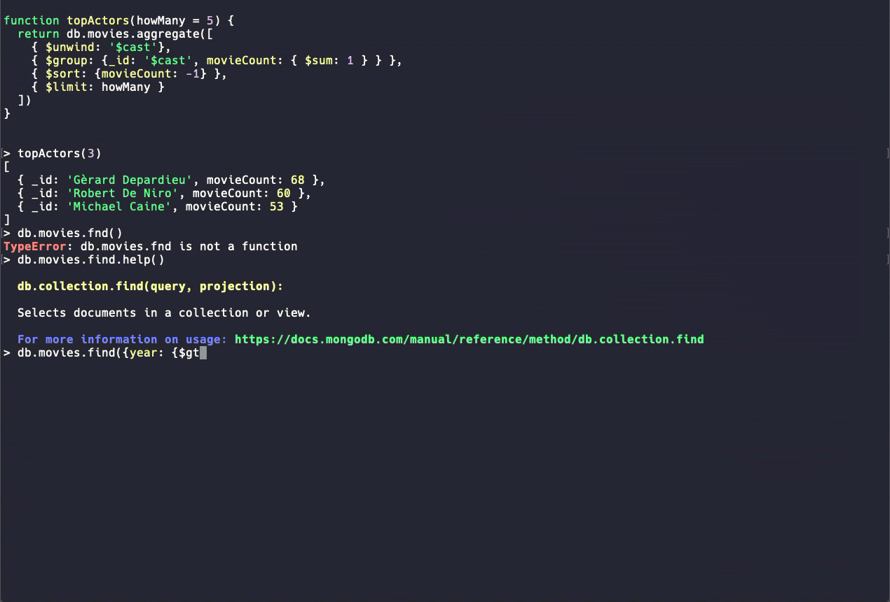

# mongosh

[Evergreen Waterfall CI](https://evergreen.mongodb.com/waterfall/mongosh)

## The MongoDB Shell

This repository is a monorepo for all the various components in the MongoDB Shell across
all environments (REPL, Browser, Compass, etc).

For our official documentation, please visit [MongoDB Docs
page](https://mongodb.com/docs/mongodb-shell).

MongoDB Shell works with MongoDB servers >= 4.0.



## Installation
You can get the release tarball from our [Downloads
Page](https://www.mongodb.com/try/download/shell). We currently maintain MongoDB
Shell on three different platforms - Windows (zip), MacOS (zip) and Linux (tgz, deb and rpm).
Once downloaded, you will have to extract the binary and add it to your PATH
variable. For detailed instructions for each of our supported platforms, please visit
[installation documentation](https://www.mongodb.com/docs/mongodb-shell/install#mdb-shell-install).

## CLI Usage

<!-- AUTOMATICALLY_INSERT_CLI_USAGE -->

```shell
  $ mongosh [options] [db address] [file names (ending in .js or .mongodb)]

  Options:

    -h, --help                                 Show this usage information
    -f, --file [arg]                           Load the specified mongosh script
        --host [arg]                           Server to connect to
        --port [arg]                           Port to connect to
        --build-info                           Show build information
        --version                              Show version information
        --quiet                                Silence output from the shell during the connection process
        --shell                                Run the shell after executing files
        --nodb                                 Don't connect to mongod on startup - no 'db address' [arg] expected
        --norc                                 Will not run the '.mongoshrc.js' file on start up
        --eval [arg]                           Evaluate javascript
        --json[=canonical|relaxed]             Print result of --eval as Extended JSON, including errors
        --retryWrites[=true|false]             Automatically retry write operations upon transient network errors (Default: true)

  Authentication Options:

    -u, --username [arg]                       Username for authentication
    -p, --password [arg]                       Password for authentication
        --authenticationDatabase [arg]         User source (defaults to dbname)
        --authenticationMechanism [arg]        Authentication mechanism
        --awsIamSessionToken [arg]             AWS IAM Temporary Session Token ID
        --gssapiServiceName [arg]              Service name to use when authenticating using GSSAPI/Kerberos
        --sspiHostnameCanonicalization [arg]   Specify the SSPI hostname canonicalization (none or forward, available on Windows)
        --sspiRealmOverride [arg]              Specify the SSPI server realm (available on Windows)

  TLS Options:

        --tls                                  Use TLS for all connections
        --tlsCertificateKeyFile [arg]          PEM certificate/key file for TLS
        --tlsCertificateKeyFilePassword [arg]  Password for key in PEM file for TLS
        --tlsCAFile [arg]                      Certificate Authority file for TLS
        --tlsAllowInvalidHostnames             Allow connections to servers with non-matching hostnames
        --tlsAllowInvalidCertificates          Allow connections to servers with invalid certificates
        --tlsCertificateSelector [arg]         TLS Certificate in system store (Windows and macOS only)
        --tlsCRLFile [arg]                     Specifies the .pem file that contains the Certificate Revocation List
        --tlsDisabledProtocols [arg]           Comma separated list of TLS protocols to disable [TLS1_0,TLS1_1,TLS1_2]
        --tlsFIPSMode                          Enable the system TLS library's FIPS mode

  API version options:

        --apiVersion [arg]                     Specifies the API version to connect with
        --apiStrict                            Use strict API version mode
        --apiDeprecationErrors                 Fail deprecated commands for the specified API version

  FLE Options:

        --awsAccessKeyId [arg]                 AWS Access Key for FLE Amazon KMS
        --awsSecretAccessKey [arg]             AWS Secret Key for FLE Amazon KMS
        --awsSessionToken [arg]                Optional AWS Session Token ID
        --keyVaultNamespace [arg]              database.collection to store encrypted FLE parameters
        --kmsURL [arg]                         Test parameter to override the URL of the KMS endpoint

  OIDC auth options:

        --oidcFlows[=auth-code,device-auth]    Supported OIDC auth flows
        --oidcRedirectUri[=url]                Local auth code flow redirect URL [http://localhost:27097/redirect]
        --oidcTrustedEndpoint                  Treat the cluster/database mongosh as a trusted endpoint
        --oidcIdTokenAsAccessToken             Use ID tokens in place of access tokens for auth
        --oidcDumpTokens[=mode]                Debug OIDC by printing tokens to mongosh's output [redacted|include-secrets]
        --oidcNoNonce                          Don't send a nonce argument in the OIDC auth request

  DB Address Examples:

        foo                                    Foo database on local machine
        192.168.0.5/foo                        Foo database on 192.168.0.5 machine
        192.168.0.5:9999/foo                   Foo database on 192.168.0.5 machine on port 9999
        mongodb://192.168.0.5:9999/foo         Connection string URI can also be used

  File Names:

        A list of files to run. Files must end in .js and will exit after unless --shell is specified.

  Examples:

        Start mongosh using 'ships' database on specified connection string:
        $ mongosh mongodb://192.168.0.5:9999/ships

  For more information on usage: https://mongodb.com/docs/mongodb-shell.
```

<!-- /AUTOMATICALLY_INSERT_CLI_USAGE -->

## Local Development

### Requirements

- Node.js v20.x

### Install

```shell
npm run bootstrap
npm run compile-cli
```

### Running Tests

Run all tests (this may take some time):

```shell
npm test
```

Run tests from a specific package:

```shell
npm -w @mongosh/cli-repl run test
```

To test against a specific version, the `MONGOSH_SERVER_TEST_VERSION`
environment variable can be set to a semver string specifying a server version,
e.g. `MONGOSH_SERVER_TEST_VERSION='>= 7.0.0-rc0' npm -w @mongosh/cli-repl run test`.

### Starting the CLI

Via npm:

```shell
npm run start <... connection string, CLI args, etc.>
```

This will compile all Typescript dependencies of the CLI package first.

Alternatively you can also run start inside the `cli-repl` package, if you're
sure everything else is compiled:

```shell
npm run -w @mongosh/cli-repl start <... connection string, CLI args, etc.>
```

### Compiling

Compile all Typescript:

```shell
npm run compile
```

Compile just the CLI ands its dependencies:

```shell
npm run compile-cli
```

Compile the standalone executable (this may take some time):

```shell
npm run compile-exec
```

Relevant environment variables for compiling are:
- `NODE_JS_VERSION`: Specify a Node.js version to use for compilation, e.g. `16.15.0` or `16.x`
- `BOXEDNODE_CONFIGURE_ARGS`: Node.js configure flags as a comma-separated list
  or JSON array, e.g. `--shared-openssl,--shared-zlib`
- `BOXEDNODE_MAKE_ARGS`: Node.js make args (no distinction from `BOXEDNODE_CONFIGURE_ARGS` on Windows)
  as a comma-separated list or JSON array, e.g. `-j12`

Compile a specific package, e.g. the `.deb` for Debian:

```shell
npm run compile-exec
npm run evergreen-release package -- --build-variant=deb-x64
```

Compilation and packaging output is written to `dist/`.

### Releasing

Refer to the [`build` package](./packages/build/README.md) documentation.

## Contributing

For issues, please create a ticket in our
[JIRA Project](https://jira.mongodb.org/browse/MONGOSH).

For contributing, please refer to [CONTRIBUTING.md](./CONTRIBUTING.md).

Is there anything else you’d like to see in MongoDB Shell? Let us know by
submitting suggestions in our [feedback
forum](https://feedback.mongodb.com/forums/929233-mongodb-shell).

## License

[Apache-2.0](./LICENSE)
