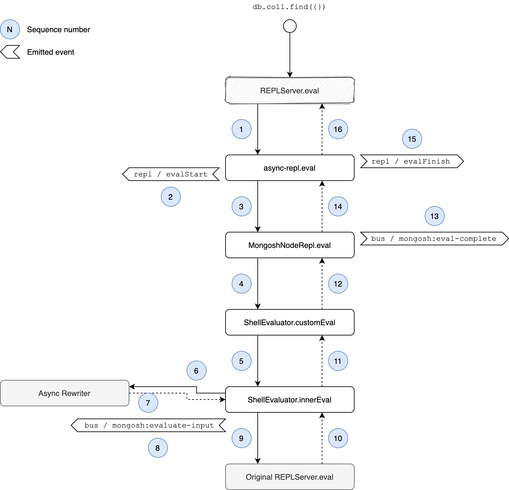

# CLI REPL Code Evaluation

This document describes the evaluation of user code in the [CLI REPL](../packages/cli-repl),
i.e. what happens when the user types `db.coll.find({})` in the CLI REPL and hits enter.

## Involved Components

### Async REPL
The [`async-repl`](../packages/cli-repl/src/async-repl.ts) is responsible for setting up the Node.js
`REPLServer` that `mongosh` is using for the CLI. Most notabily we customize the `REPLServer.eval` function
to disable certain default REPL behavior and set up customized interrupt and error handling.

### Mongosh Node REPL
The [`MongoshNodeRepl`](../packages/cli-repl/src/mongosh-repl.ts) is our main interface and orchestrator for the CLI. However it does not do any I/O
on its own but relies on an external I/O provider. It initializes and manages the Shell API abstraction
as well as handles things like access to the history or startup messages.

### Shell Evaluator
The [`ShellEvaluator`](../packages/shell-evaluator) is an intermediate package also used by non-CLI uses of the shell and is responsible
for correctly transforming user input before evaluation. It relies on the `async-rewriter2` for input
transformation.
The Shell Evaluator also detects linux-commands like `show dbs` and triggers their execution without further code transformation or evaluation.

### Async Rewriter
The [`async-rewriter2`](../packages/async-rewriter2) transforms code written in a synchronous way into
code with automatically inserted `await` statements to resolve promises returned by the Shell API.

## Execution

1. User enters `db.coll.find({})` and hits enter.
2. The `REPLServer.eval` function is called which is customized in [`async-repl`](../packages/cli-repl/src/async-repl.ts).
3. The customized `eval` function triggers [`MongoshNodeRepl.eval`](../packages/cli-repl/src/mongosh-repl.ts).
4. `MongoshNodeRepl` forwards the user input to [`ShellEvaluator.customEval`](../packages/shell-evaluator/src/shell-evaluator.ts).
5. `ShellEvaluator.customEval` calls `ShellEvaluator.innerEval`:
   1. For linux-style commands, e.g. `show dbs`, processing is immediately triggered and the result is returned up the chain.
   2. For JavaScript user input:
      1. `ShellEvaluator` calls the `async-rewriter` to rewrite user input.
      2. Rewritten user input is now evaluated in the current Shell API context using the _original, non-modified_ `REPLServer.eval`
	 function that has been passed down.
      3. The evaluation result is returned up the chain.

See also the following diagram which additionally includes important events emitted during the execution.

