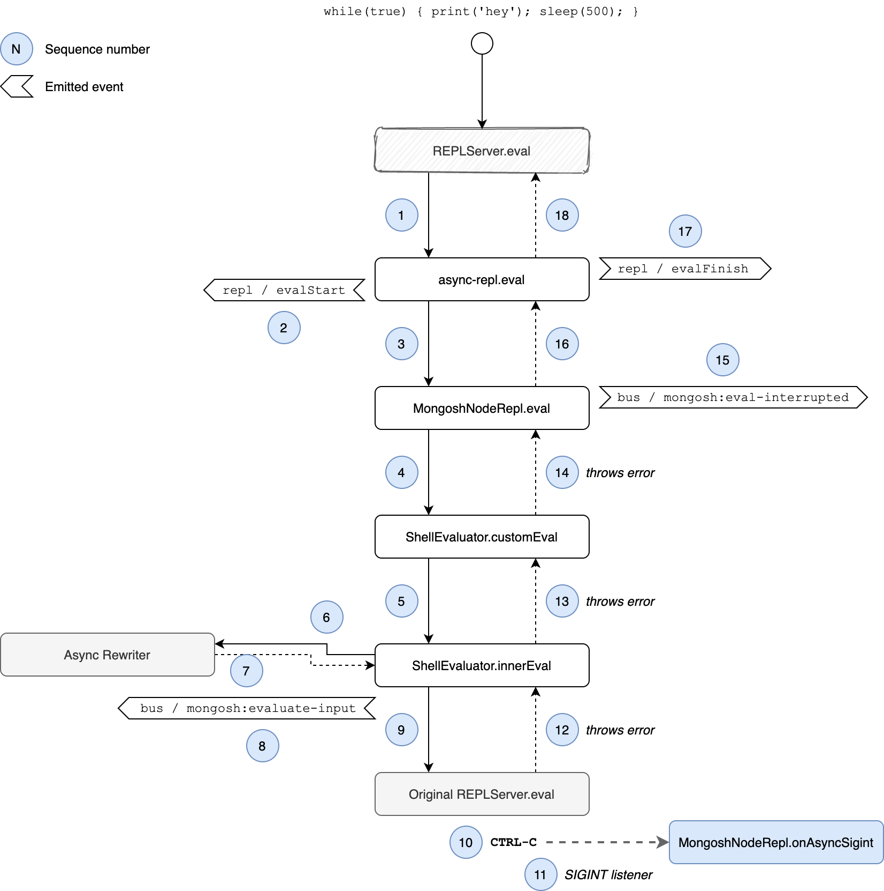
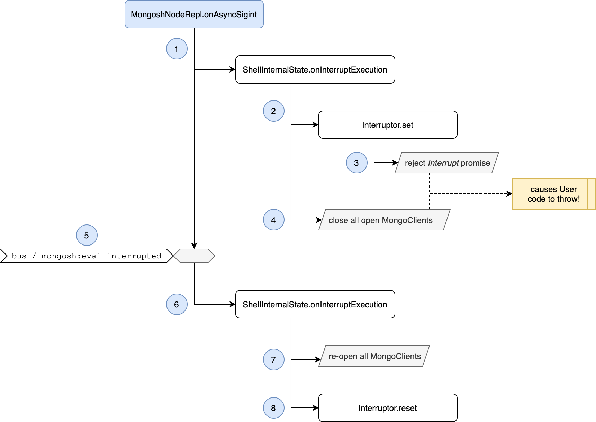

# Interrupting Async Execution

This document describes how we handle interrupting asynchronous execution of user input
when the user hits `CTRL-C`.

## Background
The Node.js REPL only handles interrupting synchronous code execution. Once the execution
becomes asynchronous however, e.g. when using promises or timeouts, the standard interrupt
handling does not work anymore.

The following is an example of synchronous code:
```javascript
while(true) {}
```
Hitting `CTRL-C` while the infinite loop is running will immediately terminate execution.

Taking a look at an example of asynchronous code using the Shell API:
```javascript
for (let i = 0; i < 10; i++) {
  db.coll.insert({ num: i });
}
```
This would basically be transformed by the `async-rewriter` to something similar to:
```javascript
(async() => {
  for (let i = 0; i < 10; i++) {
    await db.coll.insert({ num: i });
  }
});
```
As such, once the first insertion of a new document would take place, the code execution becomes
asynchronous. Hitting `CTRL-C` in the Node.js REPL would then not stop the code from running.

## Problems to keep in mind
There are a couple of things we need to keep in mind when interrupting user code execution:

1. To force termination of any running operations on the server side, the connections opened
   by the driver have to be closed. This however only works for MongoDB >4.2.
2. User code may contain `try-catch-finally` blocks so we need to make sure that the error thrown
   when terminating a connection is not just caught and execution silently continues.
3. We need to take care of code that does not use the driver, e.g. `while (true) { print('hey'); sleep(500); }`.
   The goal is to also immediately interrupt this code and make sure it does not continue in the background.

## Enforcing Interruption
Before diving into how we enforce interruption of asynchronous code, we recommend reading the topic
on [CLI code evaluation](./cli-code-evaluation.md) to get a rough understanding of control flow.

The following image contains the main aspects of code evaluation control flow but is augmented with
additional information on the interrupt handling.



### Code Evaluation
As you see in the image, the original `REPLServer.eval` evaluation will finish with an exception as triggered
by the _Interruptor_ described below.
This exception is caught inside `MongoshNodeRepl.eval` which will detect the interrupt. As such, this method
will just return an "empty" result to return this call chain. It will also emit the `mongosh:eval-interrupted`
event.
Note that at this point, printing the prompt is explicitly suppressed.

To ensure that user code is indeed interrupted while asynchronous code is being executed, we leverage TypeScript
decorators to wrap every Shell API function.

The pseudo-code wrapping to include interrupt support for the `Collection.find` API function would be similar to:
```javascript
const interruptPromise = interruptor.checkInterrupt(); // will throw immediately if CTRL-C already happened
                                                       // otherwise the contained promise is rejected on CTRL-C

try {
  return result = Promise.race([
    interruptPromise.promise(),   // this is never resolved but only rejected on CTRL-C!
    Collection.find(args)         // here we call the original function
  ]);
} catch {
  ... // throw an appropriate error (see below for exception handling details)
} finally {
  interruptPromise.destroy(); // we make sure to de-register ourselves to not leak memory
}
```

By having this race of promises, we ensure that code calling API functions will always fail immediately when
the interruptor is triggered. This will solve problem 3 outlined above.

### `SIGINT` handling
`MongoshNodeRepl.onAsyncSigint` is registered as a `SIGINT` listener while code is being executed.
The `SIGINT` listener will be called _first_ as seen in the image above by number _11_.

The control flow of the listener is outlined in the following image.



Force-closing all `MongoClient` instances as seen in the image will cause operations running on the server
to be immediately terminated and thus solve problem 1 outlined above.

### Uncatchable Errors
One of the aforementioned problems is that user code might include `try-catch` blocks which could interfere
with errors thrown by our interrupt handling code, explicitly the error thrown by the `interruptPromise`
which is an instance of [`MongoshInterruptedError`](../packages/shell-api/src/interruptor.ts).

In order to prevent user code from catching the _Interrupted Error_ we make use of the `async-rewriter`.
The `async-rewriter` will rewrite any `try-catch` blocks it finds to make sure a `MongoshInterruptedError`
is immediately re-thrown (see [`uncatchable-exceptions.ts`](../packages/async-rewriter2/src/stages/uncatchable-exceptions.ts)).

For example let us look at the following user code:
```javascript
try {
  return await db.coll.count();
} catch (e) {
  return -1;
} finally {
  print('completed');
}
```

This code would be translated (roughly) to the following:
```javascript
let isCatchable;
try {
  return await db.coll.count();
} catch (e) {
  isCatchable = isCatchableError(e); // basically make sure e != MongoshInterruptedError
  if (!isCatchable) { // we immediately re-throw our uncatchable error
    throw e;
  }
  return -1;
} finally {
  if (isCatchable) { // make sure the user's finalizer only runs if the error was catchable
    print('completed');
  }
}
```

This approach makes sure that problem 2 from above is properly dealt with.
