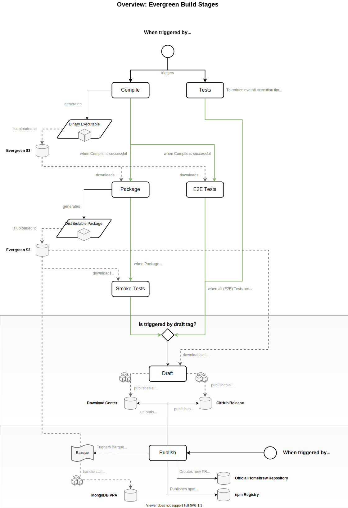

# The Mongo Shell Build System <!-- omit in toc -->

- [Releases](#releases)
  - [Publishing a new Release](#publishing-a-new-release)
  - [Branches and Tags](#branches-and-tags)
- [Evergreen CI](#evergreen-ci)
  - [Evergreen Triggers](#evergreen-triggers)
  - [Evergreen Stages](#evergreen-stages)
    - [Tests](#tests)
    - [Compile](#compile)
    - [Package](#package)
    - [E2E Tests](#e2e-tests)
    - [Smoke Tests](#smoke-tests)
    - [Draft](#draft)
    - [Publish](#publish)
- [Package Structure](#package-structure)

## Releases

New releases of the Mongo Shell project are created primarily on demand or when a bunch of worthy features or fixes is available. There is no fixed cycle for publishing new releases right now.

### Publishing a new Release

Execute the following steps to publish a new release:

1. Ensure there is a Jira _Release_ ticket in the [`MONGOSH` project](https://jira.mongodb.org/projects/MONGOSH) for the new release and move it to _In Progress_.
2. Verify that the Jira tickets you expect to be released are correctly mapped to the _Release_ ticket. Add any additional required documentation to the release ticket.
3. Trigger the draft release by running:
   ```
   pnpm run release draft
   ```
   Follow the instructions and ensure that the new draft tag to be created matches the expected release version.
4. Wait for Evergreen to finish the build and complete the draft stage.\
   _Repeat step 3 if there are any additional changes that need to be part of the release._
5. Sync main branch of the [mongodb-js/homebrew-core](https://github.com/mongodb-js/homebrew-core/) repository with the upstream.
6. Trigger the publication of the release by running:
   ```
   pnpm run release publish
   ```
   Follow the instructions and verify the inferred release version is correct.
7. Wait for Evergreen to finish the publication stage.
8. Ensure that the version bump was automatically merged into main and that it is synced up with the `mongosh@x.x.x` tag.
9. Close the Jira ticket for the release, post an update in the `#mongosh` Slack channel and ping the docs team.

### Branches and Tags

Typically, a release is always created from the main branch (currently `main`). The only exception are _patch releases_, i.e. when we need to fix an issue for an already published, already superseeded release. Patch releases are created from _release branches_ that match the following pattern:

```
release/v[0-9]+\.[a-zA-Z0-9]+\.[a-zA-Z0-9]+
```

Possible values for a release branch are:

- `release/v0.8.1`
- `release/v0.8.x`
- `release/v0.x.y`

See the following image for a general overview on how we handle these branches and the corresponding tags.


We use two different types of tags for the automated release process: draft and release tags. A release tag has the form `v<major>.<minor>.<patch>`, e.g. `v0.8.0`. A draft tag is `v<major>.<minor>.<patch>-draft.<draft>`, e.g. `v0.8.0-draft.0`.

Draft tags are used to trigger the automated release process. Every draft tag in the end leads to the generation of _potentially_ distributable packages with compiled binaries.

Release tags are used to trigger the publication of a release and its corresponding distributable packages. A release tag must referenced the commit with the most recent draft tag for that release version (example: `v0.8.0` must reference the commit with the highest `v0.8.0-draft.x` tag).

The automated release process for publication of a release will re-use the compiled binaries and packages that were created in the most recent draft tag. Thus, every release tag requires a prior draft tag to be present. The release automation process is handled by [Evergreen](#evergreen-ci).

## Evergreen CI

The Mongo Shell project uses Evergreen for Continuous Integration and the release automation process described above. Follow [Evergreen Build](https://evergreen.mongodb.com/waterfall/mongosh) to see the waterfall for the Mongo Shell project.

For full details on the project's configuration see the Evergreen configuration file [`.evergreen.yml`](../../.evergreen.yml).

### Evergreen Triggers

Evergreen builds and _patches_ are triggered in multiple ways. The Mongo Shell project is setup to be triggered by:

- New commits on the main branch (currently `main`, i.e. _waterfall builds_
- New Pull Requests against the main branch on GitHub (i.e. _patches_)
- A new tag matching `v0.0.0-draft.0` is pushed on the main or a release branch (i.e. a draft build is triggered)
- A new tag matching `v0.0.0` is pushed on the main or a release branch (i.e. a release is to be published)

### Evergreen Stages

The following image shows an overview on the different stages of the build in Evergreen.



#### Tests

The _Tests_ stage contains multiple tasks:

- Checks that the code conforms to linting guidelines
- Runs all unit tests in a matrix configuration (Node v12 and v14, server versions 4.0 / 4.2 / 4.4 / latest) as needed per package.
  _Note: Coverage is only computed after running all unit tests and combining results._
- Runs additional verification tests (VS code integration and connectivity tests)

#### Compile

The _Compile_ stage produces an executable binary (leveraging [boxednode](https://github.com/mongodb-js/boxednode)) for every target platform and uploads it to the Evergreen S3 bucket for later user.

#### Package

The _Package_ stage depends only on _Compile_ to complete successfully and not on _Tests_ to reduce overall execution time. It will download the binary executable, package it into a distributable archive (e.g. a `.deb` package or a `.zip` file) and re-upload that to Evergreen S3 for every target platform.

#### E2E Tests

The _E2E Tests_ stage depends on the _Compile_ stage to complete successfully. It will download the binary executable of the _Compile_ stage from Evergreen S3 and run JavaScript-defined E2E tests with it on all target platforms that we support.

#### Smoke Tests

The _Smoke Tests_ stage depends on the _Package_ stage to complete successfully. It will download the _packaged_ distributable and run it via Docker or SSH on different target operating systems to verify that the distributable can be installed and works as expected.

#### Draft

The _Draft_ stage depends on all three stages _Tests_, _E2E Tests_ and _Smoke Tests_ to complete successfully. _Draft_ will download all distributable packages created in the _Package_ stage and re-upload them to:

1. MongoDB Download Center: uploads to the corresponding S3 bucket without publishing the Download Center configuration.
2. GitHub Release: creates a new draft release if there is none for the release version yet and either uploads or removes and re-uploads the distributable packages. It will also generate a changelog and add it to the draft release.

#### Publish

The _Publish_ stage is independent from all other stages. As mentioned at the beginning when a release tag is pushed to the repository it will directly trigger the _Publish_ stage. It will do the following things:

1. Use [`curator`](https://github.com/mongodb/curator) to transfer the distributable packages from Evergreen S3 to the MongoDB PPAs.
2. Upload the full configuration to Download Center so the release is available there.
3. Promote the GitHub release created in _Draft_ to a published release.
4. Publishes the npm packages.
5. Creates a new PR for the [official Homebrew repository](https://github.com/homebrew/homebrew-core) to update the `mongosh` formula.

## Package Structure

The package has two major purposes:

- Custom build commands to handle the stages outlined above
- Provide easy helpers to trigger the release process

See [index.ts](./src/index.ts) for the main entry point on the different commands.
