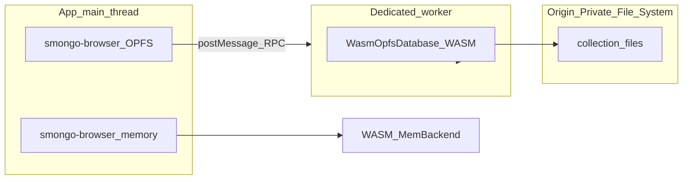

# Persistence and lifecycle (browser WASM)

This document is the contract for **how storage behaves** so applications do not have to reverse-engineer workers, locks, or OPFS. Read this once, wire recovery in one place, and treat the database as “it just persists” where the platform supports it.

## Mental model

- **One WASM binary** (`pkg/smongo_engine*.wasm`) runs the engine everywhere: native tooling, browser, Electron renderer, edge workers that can load WASM.
- **Two supported storage modes in the browser:**
  - **In-memory** — [`wrapper.js`](wrapper.js) / [`smongo-browser.js`](smongo-browser.js): `initSmongo()` then `new Database(name)`. Data dies with the JS realm (tab close, worker teardown, HMR).
  - **OPFS (persistent)** — [`opfs-wrapper.js`](opfs-wrapper.js) (re-exported from [`smongo-browser.js`](smongo-browser.js)): `initOpfsDatabase(dbName, collections)`. Data survives reloads; the engine still runs the same WASM, with collection files backed by the [Origin Private File System](https://developer.mozilla.org/en-US/docs/Web/API/File_System_API/Origin_private_file_system).

**Canonical import for applications:** `smongo-browser.js` — one module, both modes, no duplicate OPFS paths.

## Platform matrix

| Runtime | In-memory | OPFS persistence | Notes |
|--------|-----------|------------------|--------|
| Chromium / Chrome / Edge (secure context) | Yes | Yes | Dedicated worker + sync access handles; this is the reference environment. |
| Electron (Chromium renderer) | Yes | Yes | Same as Chromium; ensure `file://` vs `https://` matches your security model for storage APIs. |
| Firefox, Safari | In-memory only for persistence story | **Do not rely on OPFS sync handles** for production until you verify `FileSystemSyncAccessHandle` in a worker for your target version. Use in-memory or a different persistence strategy. |
| Serverless / edge (Cloudflare Workers, etc.) | Yes | No OPFS | No origin-private filesystem; use in-memory WASM or platform blob/KV with your own adapter. |
| Mobile in-app WebView | Yes | Version-dependent | Treat as Chromium version *X*; test on device. |

We are explicit here so you do not ship OPFS assumptions to runtimes that cannot satisfy them.

## Multi-tab

The browser allows **only one active sync access handle per OPFS file** across tabs. The implementation does **not** pretend that away; it **coordinates**:

- **Owner tab** — Holds the Web Lock `smongo-opfs-${dbName}`, runs the dedicated worker, opens sync handles, serves RPC.
- **Client tabs** — Same `dbName`: no handles; they call the owner over `BroadcastChannel('smongo-opfs-rpc-' + encodeURIComponent(dbName))` with a versioned, allow-listed RPC protocol.

Demos: [`demo/opfs-multitab-shared.html`](demo/opfs-multitab-shared.html), [`demo/opfs-multitab-handoff.html`](demo/opfs-multitab-handoff.html).

If **Web Locks** are missing, the layer falls back to broadcast-based single-tab ownership and warns; multi-tab RPC clients are not supported in that mode.

## Lifecycle: tabs, unload, bfcache

**Lock release and owner teardown** are tied to:

- `pagehide` / `beforeunload` on the owner tab (see `acquireOpfsDatabase` and `startRpcServer` in [`opfs-wrapper.js`](opfs-wrapper.js)).
- Explicit `closeOpfsDatabase(dbName)` or `wipeOpfsDatabaseDirectory(dbName)`.

**Back/forward cache (bfcache):** When the user navigates away, `pagehide` may run while the document is eligible for bfcache (`event.persisted === true`). The current implementation still participates in normal unload signaling; **after a restored bfcache navigation, treat OPFS session state as stale**. Recommended pattern:

```javascript
window.addEventListener('pageshow', (e) => {
  if (e.persisted && opfsDbName) {
    reconnectOpfsDatabase(opfsDbName, collectionList).then((db) => {
      /* replace app-held db reference */
    });
  }
});
```

Pair this with your global error handler for `OPFS_OWNER_LOST` and `OPFS_OWNER_UNAVAILABLE` (see below).

## Recovery APIs (use these; do not reimplement)

| API | When |
|-----|------|
| `reconnectOpfsDatabase(dbName, collections)` | Owner disappeared, RPC failures, post-bfcache restore, or any policy-driven full re-handshake. Clears per-tab caches and runs `initOpfsDatabase` again (may become owner or client). |
| `closeOpfsDatabase(dbName)` | Release lock and worker **without** deleting files; another tab can become owner. |
| `wipeOpfsDatabaseDirectory(dbName)` | Delete the OPFS directory after closing handles (works from client via RPC to owner). |

## Structured errors and recovery cookbook

All OPFS-facing failures that the layer controls surface as **`OpfsError`** with stable **`code`** in **`OPFS_ERROR_CODES`**. Use `isOpfsError(err)` and branch on `err.code`; log `err.message` for humans only.

| Code | Meaning | Application action |
|------|---------|----------------------|
| `OPFS_INVALID_DB_NAME` | Bad or unsafe `dbName` | Fix naming; see `assertValidDbName`. |
| `OPFS_INVALID_COLLECTION` | Bad collection name | Fix naming. |
| `OPFS_INVALID_PAYLOAD` | Malformed filter/doc/update or limits exceeded | Fix query; respect `OPFS_RPC_LIMITS`. |
| `OPFS_INVALID_REQUEST` / `OPFS_RPC_UNKNOWN_OP` | Protocol violation | Bug or version skew; log and fail closed. |
| `OPFS_RPC_TIMEOUT` | Owner did not respond in time | Retry with backoff; then `reconnectOpfsDatabase`. |
| `OPFS_RPC_TOO_MANY_IN_FLIGHT` | Client exceeded concurrent RPC cap | Throttle; queue in app. |
| `OPFS_OWNER_LOST` | Owner tab closed or notified unload | `reconnectOpfsDatabase`. |
| `OPFS_OWNER_UNAVAILABLE` | No reachable owner (e.g. first client tab, owner gone) | Open owner tab, or `reconnectOpfsDatabase` after owner exists. |
| `OPFS_RECONNECTING` | In-flight RPC cancelled during reconnect | Expected during `reconnectOpfsDatabase`; retry operation. |
| `OPFS_WORKER_ERROR` | Worker failure or restart | `reconnectOpfsDatabase`; if persistent, `configureOpfsDebug({ enabled: true })` and inspect. |
| `OPFS_WORKER_MESSAGE_TIMEOUT` | Worker round-trip exceeded `workerMessageTimeoutMs` | Retry; reconnect if repeated. |
| `OPFS_NOT_INITIALIZED` | Internal ordering bug | Reconnect; report if reproducible. |
| `OPFS_ALREADY_OPEN_ELSEWHERE` | Broadcast fallback: another tab owns | Single-tab or acquire Web Locks path. |
| `OPFS_ALREADY_INITIALIZED` | Double init for same `dbName` in same tab | One `initOpfsDatabase` per `dbName` per tab; use `reconnectOpfsDatabase` to reset. |

**Telemetry:** Emit `err.code` (not raw messages) for dashboards.

**Support / deep diagnosis:** `configureOpfsDebug({ enabled: true })` logs ownership and RPC edges (off by default).

## Architecture



## See also

- [OPFS-ARCHITECTURE.md](OPFS-ARCHITECTURE.md) — constraints and design rationale
- [README.md](README.md) — build, demos, API snippets
- [ARCHITECTURE.md](../../../ARCHITECTURE.md) — overall project architecture
